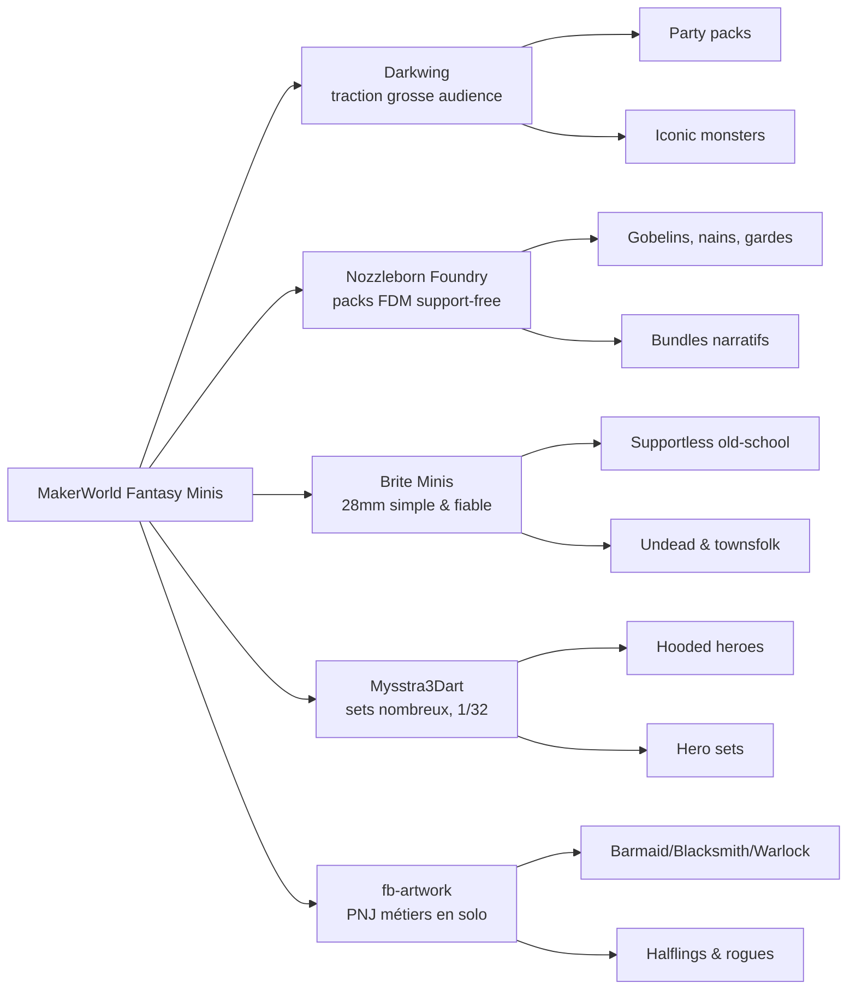
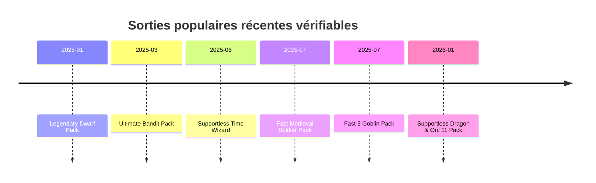

# Analyse concurrentielle des miniatures fantasy sur MakerWorld

## Résumé exécutif

Le marché MakerWorld des miniatures fantasy montre une structure assez nette. Ce qui attire le plus d’attention n’est pas la figurine isolée “artistique”, mais les **packs immédiatement jouables** et les **archétypes reconnaissables** : packs de personnages joueurs, gobelins/orques/bandits, nains, monstres iconiques comme l’owlbear ou le dragon, et PNJ de village. Les plus gros signaux vérifiables viennent des packs de entity["company","Bambu Lab","3d printer company"] A1 Mini compatibles ou au moins faciles à imprimer : **Darkwing** domine la traction “mainstream D&D” avec ses packs PJ et monstres, **Nozzleborn Foundry** domine la proposition FDM moderne orientée “support-free”, **Brite Minis** conserve une longue traîne solide sur le supportless 28 mm, tandis que **fb-artwork** capte une demande régulière sur les PNJ métiers et classes en solo. citeturn35search8turn46search20turn19search17turn48view0turn10view0turn25search1

La meilleure opportunité n’est donc pas de copier “encore un héros générique”, mais de combler l’écart entre **forte demande** et **exécution FDM vraiment fiable**. Cet écart est particulièrement visible sur quatre familles : les **packs de héros standards 28/32 mm** face aux packs populaires mais parfois non standardisés ou non explicitement FDM, les **packs d’ennemis supportless** où il reste encore du support à retirer, les **PNJ métiers** encore trop souvent vendus en figurines isolées, et les **monstres iconiques compacts** où les solutions existantes souffrent de supports nombreux, d’ailes fragiles ou d’armes cassantes. citeturn47search20turn41view3turn25search14turn52search0turn54view0

Si votre objectif est un catalogue MakerWorld rentable en visibilité et cohérent avec une machine compacte comme l’A1 Mini, la meilleure direction n’est pas “plus de détail coûte que coûte”, mais **plus de lisibilité, plus de packs, plus de preuve d’impression réelle, et deux parcours d’usage clairs** : un profil **0,2 mm “vitrine/tabletop premium”** et, quand c’est possible, une variante **0,4 mm “jeu rapide”**. Les créateurs les plus convaincants montrent précisément cela : profils prêts à imprimer, photos de vraies impressions FDM, échelle explicite, commentaires photo, et tags très orientés requêtes. citeturn15view0turn48view0turn11view1turn43search12turn43search20

Les cinq lignes à lancer en premier sont, par ordre de priorité business : **un pack de PNJ village/taverne**, **un pack de gobelins de patrouille**, **un pack de bandits de route**, **un pack de héros de base standardisés 32 mm**, puis **une ligne de monstres compacts iconiques** comme dragonnet, owlbear compact ou beholder simplifié. Ce sont les zones où la demande est déjà prouvée, mais où la concurrence FDM-optimisée n’a pas encore totalement verrouillé le terrain. citeturn25search14turn11view1turn41view3turn35search8turn19search17turn52search0

## Méthodologie et limites

Cette étude s’appuie d’abord sur les **fiches MakerWorld**, les **pages créateurs**, les **commentaires/notes publics**, puis sur des **collections MakerWorld** et quelques **retours communautaires** pour valider la réalité d’impression, surtout sur A1 Mini et buse 0,2 mm. Quand l’extraction web de MakerWorld ne renvoyait pas tous les libellés ou certaines pages détaillées, j’ai utilisé des **indexeurs tiers reprenant les pages MakerWorld** uniquement pour récupérer des dates ou des compteurs likes/téléchargements manquants. Les chiffres de **ventes exactes** ne sont pas exposés publiquement dans les fiches consultées ; j’utilise donc comme proxys les **boosts**, **likes**, **commentaires/notes**, **téléchargements** et la présence de **photos d’impressions réelles**. MakerWorld indique par ailleurs que sa plateforme suit des métriques telles que **views, downloads, prints et collects**, et son système de boost a été mis en place pour mieux refléter la valeur perçue qu’un simple volume de téléchargements. citeturn43search20turn43search6turn43search1

Il faut lire les chiffres avec nuance. Un modèle à gros téléchargements peut être populaire par facilité d’accès ou effet “icône D&D”, alors qu’un modèle plus niche mais avec davantage de boosts et de bonnes photos utilisateur peut signaler une **meilleure adéquation produit/impression**. Les retours communautaires renforcent ce point : sur les miniatures FDM, les utilisateurs valorisent fortement les modèles qui **tiennent leurs promesses sans nettoyage pénible**, surtout sur des imprimantes compactes comme l’A1 Mini. citeturn43search3turn20search10turn20search11turn46search1

### Limites ouvertes

Une partie des vieux modèles ou des fiches localisées de MakerWorld reste partiellement extractible. Sur certains concurrents historiques, l’échelle exacte, le format STL/3MF complet ou la nature “rendu vs vraie photo” n’étaient pas toujours explicitement visibles dans l’extraction. J’ai donc distingué ci-dessous les **fiches inspectées en détail** des **fiches à forte traction mais données partielles**. Enfin, les sources francophones existent surtout sous forme de pages MakerWorld localisées et de collections ; les commentaires techniques les plus utiles restent majoritairement en anglais. citeturn46search0turn46search2turn46search20

## Ce qui domine sur MakerWorld

Le signal le plus fort est la **domination des packs**. Chez Darkwing, les locomotives sont des packs de personnages joueurs et des monstres iconiques : *DnD Player Character pack5 miniatures* affiche 20 227 téléchargements et 5 332 likes dans un indexeur reprenant MakerWorld, *pack4* ressort à 7,1 k / 2,1 k dans les collections MakerWorld, et l’*Owlbear miniature on rock* apparaît à 11,7 k / 3,1 k dans les résultats MakerWorld. Chez Nozzleborn, la logique est encore plus nette : ses meilleurs signaux publics sont des **packs support-free** — nains, dragons/orques, soldats médiévaux, gobelins, classes D&D — et non des figurines solo. Chez Mysstra, les ensembles de héros capuchonnés et les sets de héros “with weapons” ressortent eux aussi, même si la ligne n’est pas une gamme FDM-tabletop aussi cohérente que Nozzleborn ou Brite. citeturn35search8turn46search20turn19search17turn32search9turn47search20turn47search2

Les familles qui reviennent le plus souvent sont les suivantes : **packs de héros/classes**, **gobelins/orques/bandits/guards**, **nains**, **PNJ métiers**, **morts-vivants simples**, puis **monstres iconiques** comme owlbear, beholder et dragon. L’information la plus exploitable pour un créateur n’est donc pas seulement “les miniatures fantasy marchent”, mais “les miniatures fantasy marchent surtout quand elles correspondent à une **fonction de jeu immédiatement compréhensible**”. citeturn32search9turn25search14turn10view0turn19search17turn52search0

### Fiches inspectées en détail

| Modèle | Créateur | Prix | Type / pack | Échelle | Formats / profils visibles | Claim supportless / FDM | Printabilité observée | Engagement public visible | Photos réelles / qualité de fiche | Source |
|---|---|---:|---|---|---|---|---|---|---|---|
| Paladin | Darkwing | Gratuit | Solo héros | Non précisée | 1 profil d’impression | Non supportless ; remix | Épée fragile, supports jugés “rough”, jambe cassée signalée par un utilisateur | 206 boosts ; 96 avis/commentaires | Fiche correcte mais plus “legacy”; pas de preuve explicite “real prints” dans la fiche | citeturn2view0turn54view0 |
| Elf Archer dnd mini | Darkwing | Gratuit | Solo héros | 28 mm via la source remixée | 2 profils d’impression | Quasi sans support ; remix | Retours très positifs, “almost no support”, impression rapide | 137 boosts ; 82 avis/commentaires | Beaucoup de photos d’utilisateurs ; bon ratio qualité/temps d’impression | citeturn13view0turn54view2 |
| Rat catcher 28mm | Brite Minis | Gratuit | Solo PNJ | 28 mm | 2 profils d’impression | Oui, “does not need any supports”, FDM-friendly | Très bons retours ; fonctionne sur A1 Mini ; pas de souci majeur remonté | 41 boosts ; 14 avis/commentaires | Description claire, commentaires photo utiles, mais fiche moins premium que Nozzleborn | citeturn11view1 |
| Supportless Dark Elf Ranger | Nozzleborn Foundry | Gratuit | Solo héros | ~37,8 mm sur base 25 mm | STL + 3MF + 1 profil | Oui, support-free explicite, 0,2 mm, A1 Mini | Un utilisateur a vu 2 supports activés par erreur de profil, corrigés ensuite ; sinon excellent | 62 boosts ; 12 avis/commentaires | Très haute qualité : mesures, angles multiples, vraies impressions FDM explicites | citeturn15view0 |
| The Goblin Ambush: Forest Killteam | Nozzleborn Foundry | Gratuit | Pack de 3 | 22/28/32 mm | 1 profil 0,2 mm | Pas 100 % supportless ; “easy minimalist supports” | Support removal parfois délicat, un peu de ponçage/finesse nécessaires | 282 boosts ; 33 avis/commentaires | Bonne fiche, nombreuses photos utilisateur, description orientée scénario | citeturn41view3 |
| Legendary Dwarf Pack - 10 support-free dwarves | Nozzleborn Foundry | Gratuit | Pack de 10 | 28 mm | 1 profil 0,2 mm, 10 plateaux | Oui, support-free explicite ; 0,4 mm possible sauf un soldat | Solide ; avantage fort : compatibilité 0,4 mm presque complète | 377 boosts ; 41 avis/commentaires | Fiche très forte ; tags riches ; commentaires actifs ; bon angle “game-ready” | citeturn48view0 |
| Green Dragon by MZ4250 | vorkosigan78 | Gratuit | Solo boss / dragon | Non précisée | 1 profil, 2 plateaux | Non ; supports manuels nombreux | Cas typique d’opportunité : ailes et queue fragiles, retrait support difficile, avis très mitigés | 101 boosts ; 25 avis/commentaires | Fiche utile mais imprimabilité faible pour un FDMiste casual | citeturn52search0 |

### Fiches à forte traction mais données partielles

| Modèle | Créateur | Prix | Type / pack | Échelle | Signal de demande | Lecture business | Source |
|---|---|---:|---|---|---|---|---|
| DnD Player Character pack5 miniatures | Darkwing | Gratuit | Pack de 5 | Non précisée | 20 227 téléchargements ; 5 332 likes ; publié le 19 juillet 2024 | Preuve majeure qu’un pack PJ reconnaissable surperforme les figurines solo | citeturn35search8 |
| DnD Player Character pack4 miniatures | Darkwing | Gratuit | Pack de 4 | Non précisée | 7,1 k / 2,1 k dans les collections MakerWorld ; publié le 4 avril 2024 | La demande “party pack” est durable, pas un accident isolé | citeturn46search20turn37search0 |
| Owlbear miniature on rock | Darkwing | Gratuit | Monstre iconique | Non précisée | 11,7 k / 3,1 k dans les résultats MakerWorld | Les monstres iconiques D&D ont une très forte aspiration, même hors supportless | citeturn19search17 |
| Skeletons! 28mm | Brite Minis | Gratuit | Pack de 3 | 28 mm | Parmi les plus fortes tractions du profil Brite ; compteurs publics de recherche autour de 2,7–2,8 k / ~721–739 | Les morts-vivants simples et supportless restent un classique FDM très sûr | citeturn9search22turn5search14turn10view0 |
| DND Hooded Heroes – 5 Miniatures 1/32 | Mysstra3Dart | Gratuit | Pack de 5 | 1/32 | ~2,4 k / 1,2 k | Très bonne traction, mais l’échelle 1/32 ouvre un trou pour un équivalent standardisé 28/32 mm | citeturn47search20 |
| set heroes with weapons for dungeons and dragons | Mysstra3Dart | Gratuit | Pack de héros | Non précisée dans l’extrait | ~2 k / 889 | Le thème “hero set” fonctionne, même hors ligne FDM dédiée | citeturn47search2 |
| DnD Miniature Halfling Female Rogue | fb-artwork | Gratuit | Solo classe / PNJ | Non précisée | 1,3 k / 286 | Les petites classes et personnages de taverne/village ont une vraie demande | citeturn25search4turn27search2 |
| DnD miniature Human male Warlock | fb-artwork | Gratuit | Solo classe / PNJ | Non précisée | 832 / 219 | Bon signal long-tail, surtout pour des campagnes à thème | citeturn25search14turn27search0 |
| Fast Medieval Soldier Pack - 5 Supportless Minis | Nozzleborn Foundry | Gratuit | Pack de 5 | Non précisée dans l’extrait | 3,0 k téléchargements ; 1,5 k likes ; daté du 13 juillet 2025 par un indexeur | Les packs d’ennemis “utilitaires” marchent très bien quand ils sont supportless | citeturn34search5turn34search17 |
| Supportless Dragon & Orc 11 Pack - 32mm miniatures | Nozzleborn Foundry | Gratuit | Pack de 11 | 32 mm | 4,4 k téléchargements ; 1,7 k likes ; daté du 6 janvier 2026 par un indexeur | Fort potentiel des bundles “boss + troupes” quand l’offre est pensée FDM | citeturn34search3turn34search19 |

Ces fiches donnent déjà des “liens de travail” très utiles à ouvrir en priorité pour benchmarker le positionnement et la présentation : **Supportless Dark Elf Ranger**, **Legendary Dwarf Pack**, **Rat catcher 28mm**, **Elf Archer dnd mini** et **Green Dragon by MZ4250**. Elles couvrent, à elles seules, les cinq enjeux de votre marché : hero solo, PNJ utile, pack supportless, bundle premium, et monstre iconique fragile. citeturn15view0turn48view0turn11view1turn13view0turn52search0

## Portefeuilles concurrents

### Cartographie concurrentielle

| Créateur | Portefeuille MakerWorld | Niche dominante | Fréquence / dynamique visible | Modèles repères | Prix / monétisation visible | Force principale | Faiblesse exploitable | Source |
|---|---:|---|---|---|---|---|---|---|
| Darkwing | 96 modèles ; 8,7 k followers ; 25,3 k likes | Packs PJ, monstres iconiques, remixes avec base aimantable | Back-catalogue très puissant ; les hits visibles restent surtout 2024–2025 | Pack4, Pack5, Owlbear, Elf Archer, Paladin | Gratuit sur MakerWorld | Très forte notoriété et sujets D&D évidents | FDM pas toujours “native first”; plusieurs hits sont des remixes ; support parfois rugueux | citeturn40view0turn35search8turn19search17turn13view0turn54view0 |
| Nozzleborn Foundry | 92 modèles ; 3,1 k followers ; 8,2 k likes | Packs support-free 28/32 mm, narrative hooks, vraie logique FDM | Cadence soutenue ; sorties vérifiables en 2025 et 2026 | Legendary Dwarf Pack, Fast Medieval Soldier, Goblin Ambush, Dark Elf Ranger, Dragon & Orc 11 Pack | Gratuit + licence commerciale visible | Meilleure lecture “A1 Mini/FDM-ready” du panel | Certains packs ont encore des supports légers ; personnalisation/baseless encore ouverte | citeturn40view0turn48view0turn41view3turn15view0turn34search3turn20search4 |
| Brite Minis | 65 modèles ; 2,4 k followers | 28 mm supportless old-school, solo/trio, silhouettes simples | Moins de nouveauté agressive, mais longue traîne stable | Skeletons, Rat catcher, Goblin Archer, Samurai | Gratuit + soutien externe visible | Fiabilité FDM, simplicité de silhouette, accessibilité | Présentation moins premium ; moins de gros packs “flagship” | citeturn10view0turn11view1turn9search22 |
| Mysstra3Dart | 855 modèles ; 31 collections ; 5,4 k followers | Créateur très large ; fantasy en sets 1/32 et collections “figures” | Très forte activité globale, mais pas une ligne FDM mini dédiée | Hooded Heroes 1/32, set heroes with weapons | Gratuit | Output massif, bonne capacité à enchainer les sets | Échelle souvent 1/32 ; focus moins net sur le tabletop FDM 28/32 | citeturn23view0turn47search20turn47search2 |
| fb-artwork | 47 modèles ; 2,4 k followers ; 6 k likes | PNJ métiers, petites classes, tavernes, halflings/warlocks | Longue traîne solo utile ; moins de gros bundles | Halfling Female Rogue, Human Male Warlock, Barmaid, Blacksmith | Gratuit | Très bon terrain sur les métiers et personnages secondaires | Offre trop éclatée en solos ; peu de différenciation FDM/supportless | citeturn25search0turn25search1turn25search14turn27search0turn27search1turn27search3 |

Le paysage concurrentiel est moins “saturé” qu’il n’y paraît. En réalité, il est partagé entre **un acteur traction-first** (Darkwing), **un acteur FDM-first** (Nozzleborn), **un acteur supportless evergreen** (Brite), **un acteur output-first** (Mysstra) et **un acteur utility-NPC** (fb-artwork). Cela veut dire qu’une gamme bien pensée peut encore gagner sa place, à condition de ne pas rester au milieu : il faut choisir un terrain clair. Pour un créateur focalisé A1 Mini, le bon terrain est **supportless 28/32 mm + bundle immédiatement jouable + fiches irréprochables**. citeturn40view0turn10view0turn23view0turn25search1

Le timing récent visible renforce encore l’intérêt d’un créateur “cadencé” à la Nozzleborn : *Legendary Dwarf Pack* est daté du 7 janvier 2025, *Ultimate Bandit Pack* du 4 mars 2025, *Supportless Time Wizard* du 15 juin 2025, *Fast Medieval Soldier Pack* du 13 juillet 2025, *Fast 5 Goblin Supportless Miniature Pack* du 26 juillet 2025, puis *Supportless Dragon & Orc 11 Pack* du 6 janvier 2026. Cela ressemble moins à un catalogue de fichiers qu’à une **programmation de line-up** — exactement la logique la plus intéressante à répliquer. citeturn33search21turn17search1turn0search4turn34search5turn17search0turn34search3

## Gaps exploitables pour une gamme FDM A1 Mini

Le premier gap est celui des **packs de héros standardisés 28/32 mm**. Darkwing prouve que les packs PJ performent massivement, et Mysstra montre qu’un set de héros capuchonnés peut aussi générer une forte traction ; pourtant, une partie de cette demande est absorbée par des modèles non explicitement pensés pour une ligne FDM premium, ou par des échelles 1/32 qui ne correspondent pas toujours au standard de table 28/32 mm. La place est donc ouverte pour une gamme “party-ready”, supportless, à silhouette plus robuste, pensée dès le départ pour 0,2 mm et A1 Mini. citeturn35search8turn46search20turn47search20turn15view0

Le deuxième gap est celui des **troupes d’ennemis réellement supportless**. Les gobelins, bandits, gardes et petits packs de combat reviennent partout, mais les meilleurs produits actuels ne sont pas tous parfaitement frictionless : certains demandent encore de la finesse au retrait de support, ou des ajustements. Cela signifie qu’un concurrent peut encore gagner en disant, et surtout en prouvant, “zéro support, zéro cicatrice gênante, zéro surprise”. citeturn41view3turn17search1turn34search5

Le troisième gap est celui des **PNJ métiers et civils en bundle**. fb-artwork capte une vraie demande sur warlock, halfling rogue, barmaid, blacksmith et autres silhouettes de campagne, mais sous forme très éclatée et peu explicitement FDM-native. Brite prouve qu’un PNJ utile comme *Rat catcher 28mm* marche bien en supportless. Le terrain le plus faible de la concurrence est donc probablement là : **des packs de village/taverne/marché** imprimables d’un coup, lisibles, résistants, et pensés comme outils de MJ plutôt que comme curiosités de catalogue. citeturn25search14turn27search0turn27search1turn27search3turn11view1

Le quatrième gap est celui des **monstres iconiques compacts**. L’owlbear tire fort, les dragons tirent fort, le beholder reste un archétype évident ; pourtant les exemples inspectés montrent aussi les limites FDM classiques : supports nombreux, ailes fragiles, queues qui cassent, armes trop fines, surfaces qui demandent du ponçage. Le besoin n’est pas “un dragon immense de plus”, mais **un dragonnet, un owlbear compact, un beholder simplifié**, conçus avec des volumes porteurs et des points d’appui intelligents. citeturn19search17turn52search0turn53search0

Le cinquième gap, souvent sous-estimé, est celui de la **qualité de la fiche**. Nozzleborn prend un avantage net non seulement parce que ses modèles sont bons, mais parce qu’il montre **la preuve** : vraies impressions FDM, mesures, base, buse utilisée, compatibilité machine, correction rapide des profils, tags riches. Or MakerWorld recommande des posts de haute qualité et indique que les commentaires avec photo peuvent être mieux mis en avant. La compétitivité n’est donc pas seulement dans le STL : elle est dans le **pack produit complet**. citeturn15view0turn48view0turn43search12turn43search20

### Idées de modèles exploitables

| Idée de modèle | Gap visé | Échelle suggérée | Notes FDM A1 Mini | Temps de modélisation | Signal marché |
|---|---|---|---|---|---|
| **Roadside Bandit Ambush** — 6 bandits + chef | Bandits demandés, mais concurrence encore dispersée entre packs et solos | 32 mm | Armes collées à la silhouette, capes coupées court, poses penchées vers l’avant, base texturée intégrée | Moyen | *Ultimate Bandit Pack* + solos bandits et PNJ métiers montrent une demande claire citeturn17search1turn25search14 |
| **Village Jobs Pack** — 8 PNJ (barmaid, blacksmith, guard, merchant, priest, innkeeper, rat catcher, farmer) | Gros trou sur les bundles de civils utiles au MJ | 28 mm | Outils épaissis, contre-appuis sur tabliers/sacs, versions “jeu rapide” 0,4 mm si possible | Moyen/élevé | fb-artwork performe sur les métiers en solo, Brite valide le côté supportless utilitaire citeturn25search14turn27search1turn27search3turn11view1 |
| **Goblin Patrol** — 5 gobelins supportless | Gobelins très demandés, mais supportlessness encore imparfaite | 28/32 mm | Pas de lances verticales, arcs collés au corps, chef plus trapu que haut, base rocheuse courte | Moyen | *Goblin Ambush* fonctionne mais demande encore finesse au retrait support citeturn41view3 |
| **Starter Party Core** — fighter, rogue, cleric, wizard, ranger, paladin | Les packs PJ sont le plus gros moteur de traction | 32 mm | Volumes lisibles, armes épaissies, variantes 0,2 et 0,4, slot d’aimant sous base | Élevé | Darkwing Pack4/5 + Mysstra montrent une demande massive sur les “hero sets” citeturn35search8turn46search20turn47search2 |
| **Hooded Cultists & Wizards** — 5 silhouettes capuchonnées | Demande forte sur les héros/wizards capuchonnés, mais taille 1/32 peu standard chez Mysstra | 32 mm | Robes fermées et staffs servant de deuxième jambe visuelle ; très peu de vides sous les manches | Moyen | *DND Hooded Heroes* et *Hooded Wizards* ont une traction claire citeturn47search20turn31search6 |
| **Fortress Dwarves** — 5 nains utilitaires | Les nains support-free marchent déjà ; marge pour des sous-thèmes plus ciblés | 28 mm | Large stance, haches et marteaux repliés, casques lisibles, compatibilité 0,4 recherchée | Moyen | *Legendary Dwarf Pack* valide très fort la famille | citeturn48view0 |
| **Kobold Engineers** — 6 kobolds outils/pièges | Moins saturé que gobelins, demande visible dans les recherches Nozzleborn | 28 mm | Sacs et outils soudés au torse, profils bas, queues en appui sur la base | Moyen | Les packs kobolds apparaissent régulièrement dans les tops Nozzleborn | citeturn32search9turn42search21 |
| **Owlbear Alpha + Cub** | Monstre iconique très demandé, mais peu d’offre explicitement FDM-native premium | 40 mm + 28 mm | Posture accroupie, griffes reliées à rocher/souche, queue et plume/poil servant de renforts | Moyen/élevé | L’owlbear tire déjà très haut chez Darkwing | citeturn19search17 |
| **Beholderling Encounter** — 1 mini-boss + 2 adeptes | Beholder = icône forte, mais impression plus délicate sur beaucoup d’offres | 40 mm + 32 mm | Réduire les eyestalks ou les relier par halo/smoke ring, dessous quasi plat | Élevé | La demande existe ; les offres visibles restent peu FDM “effortless” | citeturn53search0turn53search1 |
| **Dragon Hatchlings Pack** — 3 draconiques compacts | Dragons désirables mais souvent pénibles à imprimer | 40 mm | Ailes repliées sur le corps, queue en appui, silhouette ramassée, tête robuste | Élevé | Le dragon étudié illustre précisément une zone de douleur du marché FDM | citeturn52search0turn46search15 |

## Priorités de production

La première priorité devrait être un **pack de PNJ village/taverne**. C’est le meilleur compromis entre demande de fond, faible spécialisation concurrentielle, réutilisation en campagne, et difficulté de modélisation encore raisonnable. Les indices de marché convergent : fb-artwork vend du besoin utilitaire en solo, et Brite montre qu’un PNJ supportless bien pensé imprime sans friction. Un bundle bien titré et bien photographié peut donc devenir une “pièce à usage récurrent”, ce qui est idéal pour MakerWorld. citeturn25search14turn27search1turn27search3turn11view1

La deuxième priorité devrait être un **pack de gobelins de patrouille**. C’est probablement la meilleure ligne “evergreen combat” : gobelins = besoin universel de MJ, petite taille donc temps d’impression raisonnable, et espace concurrentiel encore ouvert sur le “vraiment sans support”. La lecture de *Goblin Ambush* est très utile ici : le sujet plaît déjà, mais l’expérience n’est pas encore complètement sans friction. citeturn41view3

La troisième priorité devrait être un **pack de bandits de route**. Il a un double usage très fort : ennemi d’embuscade et PNJ rustique. Les bandits sont aussi moins banals qu’un “orc générique”, et le thème se prête bien à une série visuelle unifiée — capuches, sabres courts, arbalètes compactes, sacs, butin — donc à une fiche MakerWorld très vendable en bundle. citeturn17search1turn25search14

La quatrième priorité devrait être un **starter party standardisé**. C’est plus coûteux à produire, mais c’est un produit “marque” : s’il est vraiment meilleur à imprimer que les packs historiques et mieux calibré que les offres 1/32, il peut devenir la porte d’entrée de toute votre gamme. C’est le bon moment pour le faire, parce que les mégahits Darkwing prouvent la demande, mais la lecture FDM-native et standardisée n’est pas encore définitivement verrouillée. citeturn35search8turn46search20turn47search20turn15view0

La cinquième priorité devrait être un **monstre iconique compact**, plutôt dragonnet ou owlbear compact avant le grand dragon. Le but n’est pas la démonstration de sculpture, mais la démonstration de **printabilité héroïque** : “c’est iconique, ça tient sur l’A1 Mini, et ça ne casse pas”. C’est exactement la faiblesse que les dragons FDM classiques laissent entrevoir aujourd’hui. citeturn19search17turn52search0

## SEO et suggestions de fiche

Sur MakerWorld, les meilleures fiches ne se contentent pas d’être trouvables ; elles donnent confiance. La plateforme indique que des posts de haute qualité avec des tags précis sont plus susceptibles d’être recommandés, et ses notes de version montrent que les commentaires/notes avec photo peuvent être mis en avant. En parallèle, les échanges communautaires sur les boosts montrent que les utilisateurs récompensent volontiers les modèles dont les **promesses d’impression** sont tenues, avec une description claire et de bonnes photos. citeturn43search12turn43search20turn43search3

Je recommanderais donc une structure de titre très agressive et très simple :

- **Roadside Bandit Ambush — 6 supportless 32mm FDM miniatures for DnD/TTRPG**
- **Village Jobs Pack — support-free 28mm NPC minis for DnD, Pathfinder**
- **Goblin Patrol — 5 supportless 28mm/32mm FDM minis**
- **Starter Party Core — 6 supportless hero minis for DnD/TTRPG**
- **Dragon Hatchlings — compact support-free 40mm FDM monsters**

La logique derrière ces titres est déjà visible chez les meilleurs performeurs : le nombre de figurines, l’usage tabletop, la promesse “supportless/support-free”, l’échelle et l’univers de recherche sont tous front-loadés dans le titre ou les tags. Les descriptions de Nozzleborn sont particulièrement bonnes sur ce point, avec beaucoup de synonymes de recherche et une promesse technique explicite. citeturn15view0turn48view0

Pour les tags, le meilleur choix est de rester **français dans votre repo**, mais **anglais sur MakerWorld** pour la découvrabilité, en ajoutant seulement quelques variantes FR si vous voulez tester des requêtes locales. Le noyau dur devrait ressembler à ceci selon la famille : `supportless`, `support free`, `dnd`, `dungeon and dragons`, `ttrpg`, `28mm`, `32mm`, `fdm`, `a1 mini`, `0.2 nozzle`, puis les tags de rôle ou créature (`goblin pack`, `bandit`, `village npc`, `dwarf`, `owlbear`, `dragon hatchling`, `wizard`, `cultist`). Cette logique est cohérente avec les tags observés sur les fiches qui performent le mieux. citeturn15view0turn48view0turn11view1

Le set photo de base devrait être standardisé sur toute votre gamme : **une photo couverture de groupe**, **trois vues de vraies impressions FDM non peintes** (avant, arrière, côté), **une photo avec un d20 ou une règle**, **une capture du plateau / profil d’impression**, puis **au moins une user story** ou une photo peinte. C’est exactement ce que fait très bien Nozzleborn sur ses meilleures fiches, et cela colle aussi avec la logique MakerWorld de valorisation des photos réelles et des interactions visuelles. citeturn15view0turn43search20

Enfin, le meilleur différenciateur SEO n’est pas un mot-clé de plus, mais une **promesse technique vérifiable**. Ajoutez systématiquement dans les premières lignes : la buse testée, l’échelle réelle, le nombre de plateaux, la présence ou non de supports, et une phrase simple du type “all photos are real FDM prints” dès que c’est vrai. Aujourd’hui, c’est ce qui sépare une fiche “jolie” d’une fiche qui convertit vraiment. citeturn15view0turn48view0turn43search3