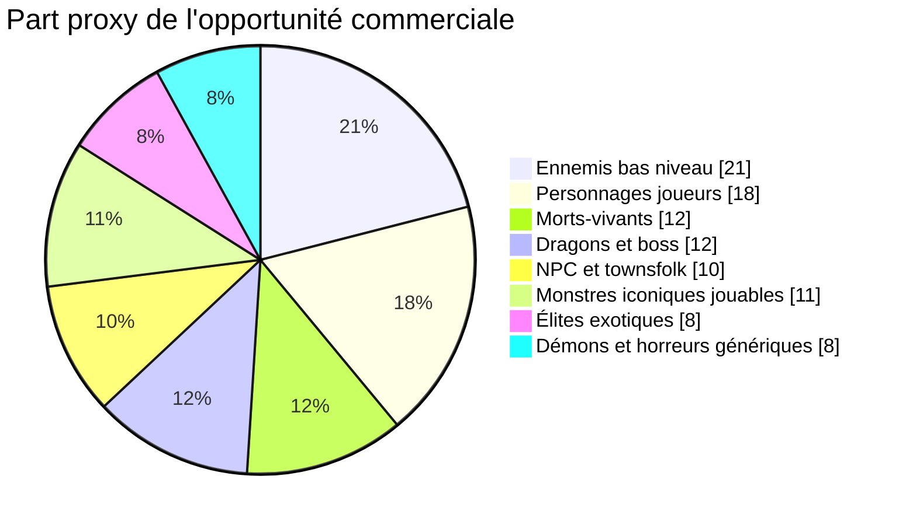
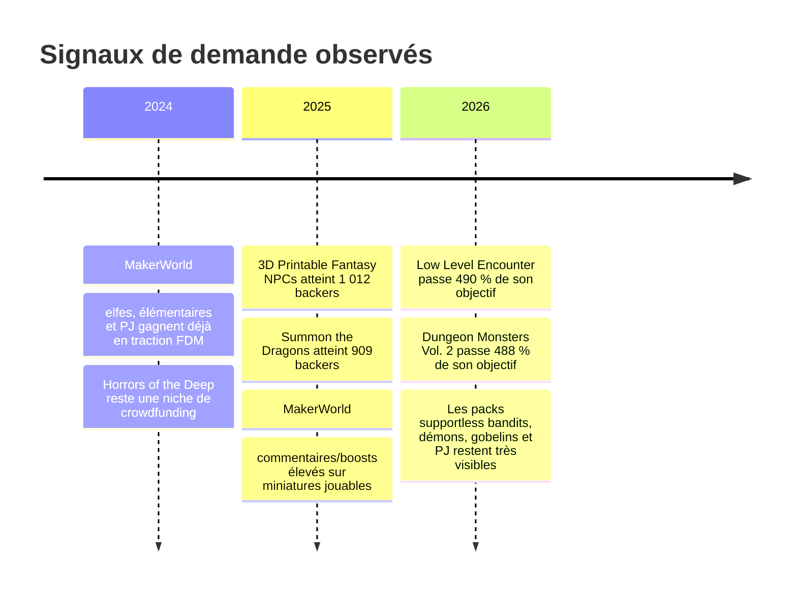
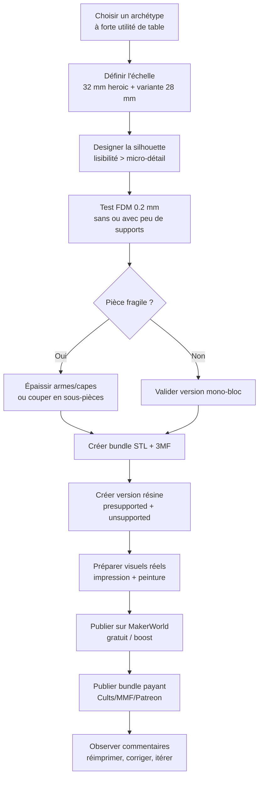

# Miniatures D&D imprimables en 3D pour une plateforme comme MakerWorld

## Résumé exécutif

Le meilleur créneau, pour une plateforme orientée impression domestique comme MakerWorld, n’est pas la “grosse pièce vitrine” ultra-complexe, mais le **milieu de gamme très jouable** : packs d’ennemis de bas niveau, packs de personnages joueurs immédiatement reconnaissables, morts-vivants génériques, dragons de petite à moyenne taille, et NPC de ville utiles en campagne. Les signaux convergent : sur entity["organization","Cults3D","3d model marketplace"], les classements “D&D” et “supportless” remontent à la fois des classes de PJ, des squelettes, des gobelins, des cultistes, des dragons et des town guards ; sur MakerWorld, des miniatures comme l’elfe ranger, le pack de personnages joueurs et le fire elemental cumulent des centaines de boosts, des notes moyennes élevées et des commentaires nombreux ; côté communauté, les fils Reddit citent en priorité gobelins, kobolds, zombies, squelettes, cultistes et dragons comme monstres/génériques les plus utiles sur table. citeturn33search0turn34search1turn34search2turn37view1turn39view0turn41view3turn8search0turn8search1turn9search13

Pour un vendeur/designer, la conclusion pratique est nette : **concevoir d’abord pour l’impression facile**, puis monter en complexité. En FDM, les meilleures fiches MakerWorld sont des modèles uniques, lisibles, 28–32 mm, souvent compatibles buse 0,2 mm, avec support minimal ou nul. En résine, les gammes les plus crédibles proposent à la fois fichiers pré-supportés et non supportés. Pour la monétisation, un positionnement “free + boosts” sur MakerWorld et “packs payants + licence commerciale” sur d’autres places de marché ou sur Patreon est plus robuste qu’un pur modèle à l’unité. citeturn16view0turn37view1turn39view0turn37view0turn31search0turn31search3turn31search4

Le risque juridique le plus important n’est pas la sculpture en elle-même, mais l’**usage d’IP D&D protégées**. entity["organization","Wizards of the Coast","rpg publisher us"] et entity["organization","D&D Beyond","digital tabletop tools"] indiquent que le SRD 5.1/5.2 est exploitable commercialement sous CC-BY-4.0, y compris pour le crowdfunding, mais que certains monstres et noms restent exclus pour raisons d’identité de marque et de propriété intellectuelle, notamment le Beholder et des noms comme Tiamat, Strahd, Orcus ou Forgotten Realms. La Fan Content Policy couvre l’usage non commercial, pas une vente libre “officielle”. citeturn21view0turn22search2turn20search0turn20search1turn23view0

## Données et méthode

Ce rapport repose sur un **panier de signaux de marché**, pas sur un relevé exhaustif des ventes globales du secteur : classements et mots-clés sur entity["organization","Cults3D","3d model marketplace"], boosts/notes/commentaires/temps d’impression sur MakerWorld, taille de communauté sur Patreon, vues/likes/collections sur MyMiniFactory, ainsi que backers et financement sur les campagnes de entity["organization","Kickstarter","crowdfunding platform"]. Là où les ventes unitaires ou téléchargements exacts n’étaient pas publiés par la plateforme, ils sont indiqués comme **non spécifiés** et remplacés par des proxys de demande. citeturn33search0turn34search1turn37view1turn39view0turn41view3turn31search0turn31search2turn31search3turn28search1turn28search11turn5search0turn5search1turn35search4turn35search7

J’ai classé les archétypes selon un score estimatif de commercialité combinant quatre dimensions : **demande observable**, **intérêt communautaire**, **facilité d’impression**, et **rentabilité/risque IP**. Les scores de “commercialité estimée” ci-dessous sont donc des **estimations analytiques**, pas des chiffres officiels de ventes. Les métriques officielles sont hétérogènes selon les plateformes : MakerWorld expose surtout boosts, profils d’impression, notes et commentaires ; Patreon montre parfois les membres et le ticket d’entrée ; MyMiniFactory remonte volontiers vues/likes de créateurs et taille de collection ; Thingiverse affiche surtout l’offre et les descriptions dans les extraits consultables. citeturn37view1turn39view0turn41view3turn31search0turn31search2turn31search3turn28search1turn28search4turn28search6turn28search8turn28search11turn26search0turn26search2turn26search3

## Signaux de marché

Le signal le plus fort, côté “offre qui remonte déjà”, est la **convergence héros + monstres de jeu courant + supportless**. Dans la collection D&D mise en avant par Cults3D, le classement de popularité (triable par téléchargements/date/likes) fait remonter, entre autres, *Guild Mage Redux*, *Skeletons! 28mm, no supports*, *Blue Dragon for 28mm Tabletop Roleplay*, *Dragonborn Warlord*, *Townsfolke: Town Guard variants*, *Cultist for 28mm Tabletop gaming* et *Barrel and Mimic Barrel*. En parallèle, le tag **Dnd Miniature** compte 412 modèles et le tag **supportless** 2,4 k modèles, avec en tête des classes comme *barbarian*, *sorcerer*, *human rogue*, *human bard*, mais aussi des lignes gobelines et un *Baby Owlbear*. Cela suggère un marché structuré autour de trois axes : **PJ reconnaissables**, **monstres iconiques de campagne**, **impression facile/FDM-friendly**. citeturn33search0turn34search1turn34search2turn27search7

Sur MakerWorld, la traction est particulièrement claire sur les miniatures **petites, jouables et très simples à lancer**. Le modèle *Elf Ranger dnd miniature* de Darkwing affiche un profil à **44 minutes** avec note **4,9/157**, **327 boosts** et **179 commentaires**. Le *Fire elemental dnd miniature* monte à **349 boosts**, **4,9/79** et **112 commentaires**, avec un profil à **1,2 h**. Le *DnD Player Character pack1 miniatures* atteint **412 boosts**, **4,7/81**, **114 commentaires**, pour un pack imprimable en **12,9 h**. À l’autre extrême “support-free pur”, le *Supportless Dark Elf Ranger* de Nozzleborn Foundry est explicitement conçu pour buse 0,2 mm, sans support supplémentaire, en **2,6 h**, pièce unique, base 25 mm incluse. citeturn37view1turn39view0turn41view3turn16view0

La profondeur commerciale du secteur est confirmée par les communautés créateurs. Sur Patreon, **BriteMinis** affiche **10 217 membres** à partir de **2,50 USD/mois** ; **Artisan Guild** affiche **21 937 membres** ; **Titan-Forge Miniatures** **22 311 membres** à partir de **9 USD/mois**. Côté MyMiniFactory, la collection *Titans of Adventure* de entity["organization","Titan-Forge Miniatures","stl miniatures creator"] regroupe **249 objets** centrés sur classes/races RPG, tandis que des créateurs fantasy comme Vae Victis, Hartolia ou Highlands cumulent des centaines de milliers à plusieurs millions de vues/likes. Ce n’est pas une preuve de ventes par archétype, mais c’est un indicateur solide de **profondeur de marché** pour les miniatures fantasy imprimables. citeturn31search0turn31search2turn31search3turn31search6turn28search1turn28search6turn28search8turn28search11

Le crowdfunding montre enfin qu’il existe une vraie demande pour des thèmes ciblés, mais **tous les thèmes ne se valent pas**. *3D Printable Fantasy NPCs* a réuni **1 012 backers** et *Summon the Dragons* **909 backers** sur Kickstarter, ce qui place très haut les **NPC** et les **dragons**. À l’inverse, un thème plus étroit comme *Horrors of the Deep* n’a réuni que **45 backers** sur BackerKit. Un thème “campagne jouable”, comme *Low Level Encounter*, atteint **9 800 €**, soit **490 % de l’objectif**. Autrement dit : les sets “utiles en session” et les pièces “wow” lisibles sur table gagnent, tandis que les niches trop spécifiques ont un plafond plus bas. citeturn5search0turn5search1turn35search4turn35search7turn35search8

Le graphique ci-dessous n’est **pas** une part de marché officielle. C’est une **part proxy de l’opportunité**, estimée à partir des signaux croisés précédents : classements officiels, boosts/notes/commentaires, taille de communauté créateur, et crowdfunding. citeturn34search1turn37view1turn39view0turn41view3turn31search0turn31search2turn31search3turn5search0turn5search1

La tendance temporelle, elle aussi, est asymétrique : les dragons et NPC performent bien en crowdfunding, tandis que MakerWorld favorise depuis 2024–2026 les miniatures **FDM-compatibles, rapides à imprimer et prêtes à jouer**. citeturn5search0turn5search1turn35search4turn37view1turn39view0turn16view0

## Classement des archétypes

### Liste classée des douze meilleurs archétypes

**Gobelins et kobolds** — **commercialité estimée : 94/100**  
C’est le meilleur compromis entre utilité de jeu, répétabilité d’achat/impression, faible risque IP et imprimabilité. Les communautés citent gobelins/kobolds comme ennemis génériques “must-have”, Cults remonte *Goblin Archers* et *Kobolds*, et le supportless couvre déjà plusieurs lignes gobelines. En pratique, c’est l’archétype le plus facile à vendre en **packs de 5 à 12 poses**. citeturn8search0turn33search0turn27search7turn32search1turn15search29

**Packs de personnages joueurs** — **commercialité estimée : 92/100**  
Le meilleur angle n’est pas “un héros unique”, mais un **pack de classes lisibles** : guerrier, paladin, ranger, roublard, magicien, clerc. Darkwing montre qu’un pack complet peut générer un très fort engagement sur MakerWorld, et les tags/supportless sur Cults remontent déjà barbarian, sorcerer, rogue et bard. La collection *Titans of Adventure* de Titan-Forge, avec 249 objets centrés sur classes/races, confirme la profondeur du segment. citeturn41view3turn27search7turn28search1

**Squelettes, zombies et morts-vivants d’entrée de gamme** — **commercialité estimée : 90/100**  
Très bons pour le jeu, très bons pour les packs, très bons pour la peinture rapide. Les communautés citent régulièrement squelettes, ghouls et zombies comme “generic enemies”, Cults remonte *Skeletons! 28mm, no supports*, *Skeleton King* et *Undead Bone Golem*, et BriteMinis a une ligne support-free 28 mm très claire sur ce segment. citeturn8search0turn8search1turn34search1turn34search2turn26search2turn24view3

**Dragons jeunes, wyrmlings et dragons “boss de table”** — **commercialité estimée : 88/100**  
Les dragons sont un **segment premium** : moins universels que gobelins/undead, mais plus chers et très désirables. *Summon the Dragons* atteint 909 backers, Cults remonte un *Blue Dragon*, et les dragons mz4250 sur Thingiverse couvrent tous les âges avec impression par morceaux pour les grands formats. Très bon potentiel, mais il faut accepter des temps d’impression plus longs et plus de multipart. citeturn5search0turn34search1turn26search3turn26search7turn26search18turn25view1turn25view3

**Bandits, cultistes et brigands** — **commercialité estimée : 87/100**  
Leur force est la fréquence d’usage. Sur table, ils remplacent aussi bien des pillards, des hommes de main que des cultistes anonymes. Cults classe *Cultist for 28mm Tabletop gaming* dans sa popularité D&D, Reddit les cite parmi les meilleurs ennemis génériques, et MakerWorld montre déjà un *Easy 10 Supportless Bandit Pack*. Très bon segment “campagne low/mid-level”. citeturn34search1turn8search0turn32search2turn15search13

**Orcs et hobgobelins** — **commercialité estimée : 85/100**  
Moins universels que gobelins, mais excellent segment “armée/warband”. MakerWorld pousse des orcs supportless, des hordes d’orcs et des packs dragon+orc, tandis que Thingiverse/communautés montrent une demande régulière pour orcs et hobgobelins. À vendre de préférence en **unités cohérentes**, pas seulement en pièce solo. citeturn15search5turn15search18turn15search22turn37view0turn26search4turn26search26turn9search10

**NPC de ville, gardes, marchands, paysans, aubergistes** — **commercialité estimée : 83/100**  
C’est probablement le créneau **le plus sous-exploité** parmi les segments à forte utilité. La campagne *3D Printable Fantasy NPCs* a dépassé 1 000 backers, Cults fait remonter *Town Guard variants*, et Reddit montre une demande persistante pour townsfolk/NPC/commoners. Commercialement, la bonne approche n’est pas l’unité, mais le **lot de scène** : marché, taverne, garde, notables, dockworkers. citeturn5search1turn34search1turn43search2turn43search5turn43search12

**Mimics, coffres et props hostiles** — **commercialité estimée : 81/100**  
Très bons produits “coup de cœur”, faciles à photographier et à peindre, avec un bon rapport complexité/impact. Cults remonte *Barrel and Mimic Barrel* dans ses classements D&D, les communautés qualifient le mimic d’iconique, et MakerWorld aligne plusieurs variantes mimic. C’est un excellent complément de gamme, surtout en **set de décor piégé**. citeturn34search1turn34search2turn9search17turn38search16turn40search25

**Elementals** — **commercialité estimée : 80/100**  
Le sous-segment “élémentaires” fonctionne bien parce qu’il combine lisibilité, variété visuelle et risque IP faible. Le *Fire elemental* de Darkwing a un engagement très fort sur MakerWorld, et Cults remonte *Earth Elemental* dans sa popularité D&D. Très bonne cible pour des sorties **mono-monstre premium** ou de petits duos/trios par élément. citeturn39view0turn33search1

**Owlbears et grosses bêtes brutales** — **commercialité estimée : 79/100**  
Segment très “tabletop” : fort imaginaire, gros volume visuel, bonne peinture, bonne présence sur la table. Cults remonte *Owlbear for 28mm tabletop gaming* dans le tag D&D, Reddit/minipainting mentionne régulièrement l’owlbear parmi les pièces favorites ou emblématiques, et MakerWorld le réutilise comme pivot de collection DnD. Moins répétable qu’un pack de gobelins, mais meilleur en ticket moyen. citeturn33search0turn9search5turn9search8turn40search24

**Démons, diables et horreurs génériques non brandées** — **commercialité estimée : 76/100**  
Le segment est attractif, mais doit rester **générique** pour éviter la zone grise d’IP. Nozzleborn propose déjà un pack de 12 démons supportless, Cults remonte des *demonic warrior* et *female demon head*, et le tag D&D expose plusieurs monstres infernaux. Bon rendement si vous les traitez comme une **faction fantasy dark** plutôt que comme des références directes à une licence donnée. citeturn32search9turn33search0turn33search1

**Ancestries et héros exotiques** — **commercialité estimée : 74/100**  
Dragonborn, warforged, tabaxi, yuan-ti, aarakocra : ce segment est bon pour la différenciation, mais moins sûr que les classes humaines/elfiques standards. Cults montre Dragonborn, Tabaxi Ranger et Yuan-Ti dans ses classements D&D ; MakerWorld pousse aussi warforged et dragonborn dans les collections de Darkwing. À garder comme **extension de catalogue**, pas comme cœur de gamme. citeturn34search1turn33search1turn40search3turn40search6turn41view3

**À éviter en priorité malgré leur notoriété : les monstres D&D exclus du SRD**  
Le cas le plus clair est le **Beholder**. Il est explicitement cité par D&D Beyond parmi les monstres exclus du SRD 5.2 pour raisons d’identité de marque/IP. En pratique, même s’il est iconique et apprécié par la communauté, son **risque juridique** le rend moins attractif qu’un mimic, un owlbear, un dragon générique ou un elemental. citeturn21view0turn22search2turn19search6

### Tableau comparatif synthétique

| Archétype | Demande | Difficulté FDM | Profitabilité probable | Risque IP |
|---|---:|---:|---:|---:|
| Gobelins / kobolds | Très élevée | Faible à moyenne | Très élevée | Faible |
| Packs de PJ | Très élevée | Moyenne | Très élevée | Faible |
| Morts-vivants | Très élevée | Faible | Élevée | Faible |
| Dragons jeunes / boss | Élevée | Élevée | Élevée | Faible à moyenne |
| Bandits / cultistes | Élevée | Faible à moyenne | Élevée | Faible |
| Orcs / hobgobelins | Élevée | Moyenne | Élevée | Faible |
| NPC / townsfolk | Élevée | Faible | Moyenne à élevée | Faible |
| Mimics / props hostiles | Moyenne à élevée | Faible | Moyenne à élevée | Faible |
| Elementals | Moyenne à élevée | Moyenne | Moyenne à élevée | Faible |
| Owlbears / grosses bêtes | Moyenne à élevée | Moyenne | Moyenne | Faible |
| Démons / horreurs génériques | Moyenne | Moyenne à élevée | Moyenne | Moyenne |
| Héros exotiques | Moyenne | Moyenne | Moyenne | Faible à moyenne |

Cette synthèse résume les preuves détaillées juste au-dessus. Les données de ventes unitaires exactes restent souvent **non spécifiées** sur Thingiverse/MyMiniFactory, d’où l’usage de proxys de demande. citeturn26search0turn26search2turn26search3turn28search1turn31search0turn31search2turn31search3

## Standards techniques et production

### Échelles recommandées

La meilleure stratégie n’est pas de choisir **une** échelle, mais **deux masters commerciaux**. Je recommande **32 mm heroic** comme version principale pour les humanoïdes vendus sur une plateforme type MakerWorld, et **28 mm** comme variante de compatibilité. La raison est simple : le marché montre à la fois des standards 28 mm support-free chez BriteMinis/Thingiverse, des miniatures 28 mm sur MakerWorld, et des packs 32 mm supportless chez Nozzleborn. En FDM, le 32 mm heroic laisse plus de marge pour épaissir armes, doigts, capes et traits du visage sans trop dégrader la lisibilité en jeu. citeturn26search0turn26search2turn26search4turn32search3turn37view0turn15search3turn15search7

| Usage | Recommandation |
|---|---|
| Humanoïdes medium jouables | 32 mm heroic principal, 28 mm alternatif |
| Gobelins / kobolds | 30–32 mm “visuellement lisibles”, base 25 mm |
| NPC de ville | 28–32 mm selon niveau de détail |
| Owlbears / elementals / brutes | 40–60 mm de haut, base 40/50 mm |
| Wyrmlings / jeunes dragons | plusieurs tailles, bases distinctes |
| Dragons/boss “grande table” | multipart, tailles séparées, pièces clés orientées |

### Formats de fichiers recommandés

Le couple gagnant est **STL + 3MF**. Le STL reste le format universel. Le 3MF est indispensable pour une plateforme pensée autour de l’écosystème entity["company","Bambu Lab","3d printer maker"], car la documentation officielle Bambu/MakerWorld indique l’upload de STL/CAD/autres 3MF, tandis que Bambu Studio supporte notamment `.3mf`, `.stl`, `.stp`, `.step`, `.amf` et `.obj`. Côté Cults, les formats supportés incluent STL, OBJ, STEP, 3MF et SCAD. Concrètement, publiez **STL brut universel**, **3MF préconfiguré MakerWorld/Bambu**, et, si vous gérez le multimatériau ou certains workflows artistiques, un **OBJ** en option. citeturn13search0turn13search8turn14search25

| Format | À publier | Pourquoi |
|---|---|---|
| STL | Oui, systématiquement | compatibilité maximale |
| 3MF | Oui, prioritaire pour MakerWorld | profils d’impression, plateaux, orientation, supports |
| OBJ | Optionnel | workflows multicolore / sculpture / échange |
| Presupported STL | Oui pour la résine | attente marché premium |
| Unsupported STL | Oui | flexibilité expert/utilisateur |

### Guidelines de production

Pour les **humanoïdes medium** destinés au FDM, il faut viser **pièce unique** ou quasi unique, sans support ou avec support minimal. Les retours communauté sont très cohérents : pour concevoir du supportless, il faut éviter les surplombs abrupts, couper les zones problématiques si nécessaire, et exploiter des fonctions de type *Make Overhangs Printable* dans Orca/Cura quand le modèle ne peut pas être entièrement repensé. C’est exactement ce qui explique la traction des catalogues BriteMinis, Fat Dragon, Arbiter ou Nozzleborn dans les communautés FDM. citeturn27search3turn14search9turn14search10turn27search5turn31search1

Les **armes fines** sont le point de casse le plus fréquent. Les commentaires MakerWorld sur l’Elf Ranger et le pack de personnages joueurs notent des problèmes récurrents sur l’arc, les dagues, les capes et certains supports ; d’autres utilisateurs soulignent toutefois une bonne sortie avec support minimal ou retrait propre. Cela plaide pour une règle de design simple : **épaissir de 10 à 20 % les éléments longs/fins**, relier les armes au corps ou à la cape quand c’est possible, et proposer, pour les versions payantes, une variante “durable tabletop” à géométrie renforcée. citeturn37view1turn41view3turn14search7turn38search30

Pour les **gros monstres** et surtout les dragons, le multipart devient non pas un luxe, mais une obligation commerciale. Les pages Thingiverse de dragons mz4250 recommandent l’impression “en pièces” pour les grandes tailles et couvrent plusieurs âges/volumes. Le bon standard vendeur est donc : **wings/tail/armes/bannières en pièces, connecteurs simples, tolérances généreuses, et une version petite taille mono-bloc si possible**. citeturn26search3turn26search7turn26search18turn26search25

Pour la **résine**, le marché attend généralement un duo **presupported + unsupported**. L’exemple *Orc Warrior of Vogland* sur MakerWorld le dit explicitement : impression résine recommandée, fichiers pré-supportés et non supportés inclus, détail fin, 28–32 mm. C’est exactement le package qui rassure un acheteur Etsy/Cults/MMF et qui justifie un prix plus élevé. citeturn37view0

Le **hollowing** doit rester réservé aux grosses pièces résine — dragons, boss, statues, krakens — et non devenir une habitude pour les humanoïdes 28–32 mm. La documentation Formlabs indique qu’un objet creux permet de **conserver du matériau** et de **réduire le temps d’impression** ; en pratique, cela a du sens sur les grosses masses, beaucoup moins sur un humanoïde moyen où la simplicité de post-traitement prime. entity["company","Formlabs","3d printing company"] le documente explicitement, et cela recoupe la logique des dragons imprimés en plusieurs pièces plutôt qu’en monobloc massif. citeturn44search1turn44search3turn44search6turn26search3turn26search7

Enfin, pour MakerWorld, je recommande de livrer **un profil 0,2 mm bien testé** en priorité, et **un profil 0,4 mm de secours** si la silhouette le tolère. Les meilleures pages DnD sur MakerWorld insistent sur la compatibilité 0,2/0,4 mm, et la FAQ Bambu confirme que la buse 0,2 mm fonctionne bien avec PLA/PETG/ABS/ASA, à condition d’éviter les filaments chargés en particules. citeturn16view0turn15search3turn44search4

## Prix, tags et fiches produit

### Stratégie de prix

Comme MakerWorld fonctionne d’abord comme **plateforme d’acquisition, de boost et de profil d’impression**, la meilleure stratégie est en général **gratuite sur MakerWorld**, **payante ailleurs**. Les ancrages de prix visibles vont dans ce sens : sur Cults, les héros supportless tournent autour de **2–4 USD**, les gobelins supportless autour de **2,90–4,90 USD**, un *Baby Owlbear* autour de **5,84 USD**, des bundles “kill team” autour de **19,95–39,94 USD**. Sur Patreon, BriteMinis démarre à **2,50 USD/mois** et Titan-Forge à **9 USD/mois**. Cela dessine une échelle robuste. citeturn27search7turn33search1turn31search0turn31search3

| Offre | Fourchette recommandée |
|---|---:|
| Humanoïde solo standard | 2,49–3,99 € |
| Monstre solo signature | 3,99–6,99 € |
| Pack 3–5 figurines | 6,99–11,99 € |
| Pack 6–12 figurines / encounter pack | 12,99–19,99 € |
| Boss/multipart dragon | 14,99–29,99 € |
| Bundle mensuel Patreon/Tribe | 4,99–9,99 € entrée ; 9,99–14,99 € premium |

Ces fourchettes sont des **recommandations** dérivées des prix visibles sur Cults et des tickets d’entrée Patreon, pas des prix imposés par les plateformes. Pour MakerWorld lui-même, il est plus rationnel d’utiliser les modèles gratuits comme **entonnoir vers packs premium, licence commerciale, Patreon ou seconde place de marché**. citeturn27search7turn31search0turn31search3turn31search4

### Tags et mots-clés recommandés

Les tags gagnants observés sur MakerWorld mélangent **intention d’usage**, **échelle**, **technique d’impression** et **fantasy SEO**. Les pages *Supportless Dark Elf Ranger* et *Fire Elemental* utilisent par exemple *dnd*, *dungeon and dragons mini*, *dnd 28mm*, *player character*, *supportless*, *support-free*, *0.2 nozzle*, *miniature*, *elemental*, *dark elf*, etc. citeturn16view0turn39view0

Je recommande des tags **bilingues** pour améliorer la découvrabilité :

| Catégorie | Tags |
|---|---|
| Univers / usage | `dnd`, `ttrpg`, `tabletop`, `fantasy miniature`, `miniature de jeu`, `compatible 5e`, `rpg miniature` |
| Technique | `supportless`, `support-free`, `fdm friendly`, `0.2 nozzle`, `3mf`, `stl`, `easy print`, `paint friendly` |
| Échelle | `28mm`, `32mm heroic`, `25mm base`, `heroic scale` |
| Type | `goblin`, `kobold`, `orc`, `bandit`, `cultist`, `skeleton`, `zombie`, `mimic`, `elemental`, `dragon`, `npc`, `town guard`, `merchant` |
| Personnage | `player character`, `ranger`, `rogue`, `paladin`, `wizard`, `cleric`, `fighter` |

### Descriptions produit prêtes à l’emploi

**Exemple pour un pack de gobelins supportless**  
*Pack d’embuscade gobeline prêt pour la table, conçu pour l’impression FDM rapide et propre. Chaque figurine privilégie une silhouette lisible, des armes renforcées et des poses variées pour donner du rythme à vos rencontres de niveau bas. Inclus : STL universels, 3MF optimisé MakerWorld, bases 25 mm, et une version renforcée pour usage intensif en campagne.*

**Exemple pour un personnage joueur**  
*Ranger elfique 32 mm heroic pensé pour le jeu et la peinture. Le modèle offre un excellent compromis entre détail, robustesse et temps d’impression, avec une silhouette claire dès la sortie du plateau. Inclus : STL, 3MF Bambu/Orca, variante 28 mm, et base aimantable selon système.*

**Exemple pour une pièce premium**  
*Jeune dragon multipart, conçu pour un rendu fort sur table sans devenir un cauchemar d’assemblage. Ailes, queue et corps sont séparés avec clés simples, afin d’améliorer l’impression, la peinture et la réparation éventuelle. Inclus : fichiers supportés/non supportés, STL + 3MF, et deux positions de tête.*

### Formulation à éviter pour limiter le risque IP

Évitez dans vos fiches : **“officiel D&D”**, les logos de la marque, les noms exclus du SRD comme **Beholder**, et les références directes à **Forgotten Realms**, **Tiamat**, **Strahd** ou autres noms explicitement protégés/exclus. Préférez **“miniature fantasy pour TTRPG”**, **“compatible 28–32 mm”**, **“monstre aberrant à œil central”** seulement si vous redessinez une créature vraiment originale et sans usage d’éléments protégés. citeturn21view0turn22search2turn20search0turn20search1turn23view0

## Concurrents, pipeline et limites

### Exemples de concurrents pertinents

| Concurrent / exemple | Pourquoi c’est important | Signal principal |
|---|---|---|
| **BriteMinis** | Référence du support-free 28 mm, très proche du besoin MakerWorld/FDM | 10 217 membres Patreon, 150+ modèles gratuits sur site citeturn31search0turn31search4 |
| **Titan-Forge Miniatures** | Référence “gros catalogue + classes/races + modèle d’abonnement” | 22 311 membres Patreon ; collection *Titans of Adventure* à 249 objets citeturn31search3turn28search1 |
| **Artisan Guild** | Référence “peinture-friendly” et communauté massive | 21 937 membres Patreon ; communication explicite “easy and fun to paint” citeturn31search2turn31search6 |
| **Darkwing** sur MakerWorld | Preuve qu’un catalogue DnD simple et jouable peut générer beaucoup d’engagement gratuit | Pack PJ, elf ranger, fire elemental avec centaines de boosts et nombreuses notes/commentaires citeturn37view1turn39view0turn41view3 |
| **Nozzleborn Foundry** | Référence supportless 32 mm, orientée FDM pur | ranger support-free, bandits, orcs, démons, dragons, retours positifs communauté citeturn16view0turn15search13turn15search6turn15search2turn15search29 |
| **VogMan** | Exemple clair d’offre résine 28–32 mm avec presupported + unsupported | orc 28–32 mm, détail peintre, résine recommandée citeturn37view0 |
| **Cults3D D&D Collection** | Référence d’archétypes qui remontent en visibilité organique | skeletons, blue dragon, town guard, cultist, mimic barrel, dragonborn, etc. citeturn34search1turn34search2 |
| **Créateurs MMF fantasy** | Indicateur de profondeur du marché, surtout pour sorties mensuelles et bundles | millions de vues/likes pour Vae Victis, Hartolia, Highlands, Dark Realms citeturn28search6turn28search8turn28search11turn28search15 |

### Pipeline recommandé de développement produit

Le pipeline ci-dessous est optimisé pour les attentes observées sur MakerWorld/Bambu, pour la nécessité STL+3MF, et pour les points d’échec récurrents identifiés dans les commentaires communautaires : supports, armes trop fines, et manque de variantes de fichiers. citeturn13search0turn13search8turn27search3turn37view1turn39view0

### Questions ouvertes et limites

Les **ventes unitaires détaillées** restent souvent non spécifiées sur Thingiverse, MyMiniFactory et certaines pages Patreon publiques ; il faut donc raisonner avec des proxys visibles comme les boosts, les notes, les membres, les vues, la taille des collections et les backers. citeturn26search0turn26search2turn26search3turn28search1turn31search0turn31search2turn31search3

Les **données Facebook** sont utiles comme signal communautaire, mais limitées parce que beaucoup de groupes sont semi-fermés ou partiellement visibles dans les extraits. On peut constater qu’il existe bien des groupes dédiés à la 3D de miniatures et terrain, mais les métriques détaillées y sont souvent indisponibles ou incomplètes. citeturn10search0turn10search6turn10search10turn8search16

Enfin, le rapport privilégie le **risque ajusté**. Autrement dit : un monstre très populaire mais juridiquement risqué n’est pas un bon premier pari commercial. Pour un lancement MakerWorld-like, il vaut mieux **vendre souvent un gobelin robuste** qu’entrer trop tôt dans une zone grise d’IP avec un monstre “trop D&D” non couvert par le SRD. citeturn21view0turn22search2turn20search0