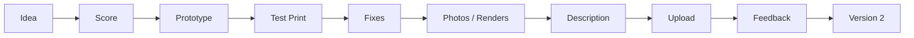

# Launch Pipeline

This file defines the repeatable process for taking a 3D printable model from idea to release.

Use this pipeline for MakerWorld, Cults3D, or any future marketplace.

## Pipeline overview

## Stage 1: Idea

Goal:

> Capture the idea without overthinking it.

Checklist:

- [ ] Add the idea to `ideas/product-ideas.md`.
- [ ] Write a one-sentence concept.
- [ ] Identify the target user.
- [ ] Identify the problem solved or visual appeal.

Exit condition:

- The idea is clear enough to score.

## Stage 2: Score

Goal:

> Decide if the idea deserves serious modeling time.

Checklist:

- [ ] Use `templates/product-scorecard.md`.
- [ ] Check printability risk.
- [ ] Check tolerance risk.
- [ ] Check marketplace fit.
- [ ] Decide: prioritize, prototype, simplify, pause, or reject.

Exit condition:

- The next smallest useful action is clear.

## Stage 3: Prototype

Goal:

> Build the smallest version that proves the idea.

Checklist:

- [ ] Keep the first prototype small.
- [ ] Avoid building the full modular system immediately.
- [ ] Model only the essential function.
- [ ] Avoid screws or tight threads unless absolutely necessary.
- [ ] Create a test piece if tolerances matter.

Exit condition:

- A printable prototype file exists.

## Stage 4: Test print

Goal:

> Verify the model works on a real printer.

Checklist:

- [ ] Print the prototype.
- [ ] Check scale.
- [ ] Check strength.
- [ ] Check fit/tolerance.
- [ ] Check support requirements.
- [ ] Note any failure points.

Exit condition:

- The model either works, needs fixes, or should be paused.

## Stage 5: Fixes

Goal:

> Improve reliability before release.

Checklist:

- [ ] Fix weak points.
- [ ] Add clearance if fit is tight.
- [ ] Simplify fragile details.
- [ ] Reduce supports if possible.
- [ ] Update the product page with lessons learned.

Exit condition:

- The model is reliable enough for public users, not just the user's own printer.

## Stage 6: Photos / renders

Goal:

> Make the model easy to understand visually.

Checklist:

- [ ] Create clean render or photo.
- [ ] Show the product function clearly.
- [ ] Show scale if useful.
- [ ] Show included versions.
- [ ] Avoid confusing thumbnails.

Exit condition:

- The thumbnail communicates the product quickly.

## Stage 7: Description

Goal:

> Write a clear marketplace listing.

Checklist:

- [ ] Use `templates/makerworld-description-template.md` or `templates/cults3d-description-template.md`.
- [ ] Explain what the model is.
- [ ] Explain who it is for.
- [ ] List included files.
- [ ] Include print settings.
- [ ] Mention assembly or tolerance notes.
- [ ] Add keywords naturally.

Exit condition:

- Listing text is ready to upload.

## Stage 8: Upload

Goal:

> Publish cleanly.

Checklist:

- [ ] Upload files.
- [ ] Upload images/renders.
- [ ] Check title.
- [ ] Check description.
- [ ] Check tags/keywords.
- [ ] Check license.
- [ ] Download/check the uploaded files if needed.

Exit condition:

- Product is live.

## Stage 9: Feedback

Goal:

> Track what customers say after release.

Checklist:

- [ ] Check comments and reviews.
- [ ] Add complaints to `feedback/customer-feedback.md`.
- [ ] Mark repeated issues.
- [ ] Decide if a fix or V2 is needed.

Exit condition:

- Feedback is captured and categorized.

## Stage 10: Version 2

Goal:

> Improve only if the product has enough signal.

Checklist:

- [ ] Identify the strongest improvement.
- [ ] Fix repeated complaints.
- [ ] Add useful variations.
- [ ] Avoid bloating the product unnecessarily.
- [ ] Update listing notes.

Exit condition:

- V2 is released or intentionally paused.

## Current pipeline status

| Product | Stage | Next action | Notes |
|---|---|---|---|
| Miniature transport organizer | Idea / Score | Use scorecard and decide tray vs compact case | Strongest current direction |
| Knight series | Idea | Choose next knight concept | Proven seller category |
| Wild animals | Idea | Validate first animal concept | Later opportunity |
| Dragon stand | Paused | Do not continue unless simplified heavily | Lesson learned from overcomplexity |

## Pipeline rules

- Do not skip test printing for functional parts.
- Do not release tolerance-sensitive designs without clear notes.
- Do not create a full product family before testing one small version.
- Do not let a cool mechanism override user reliability.
- Do not make the model harder to print just to make it look more impressive.
