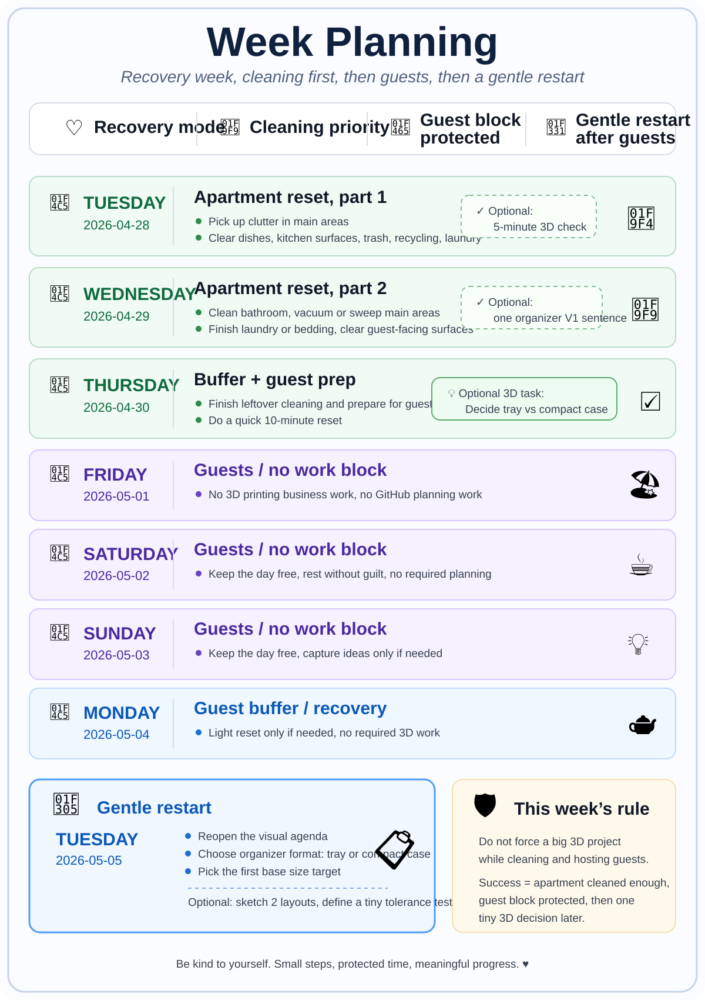
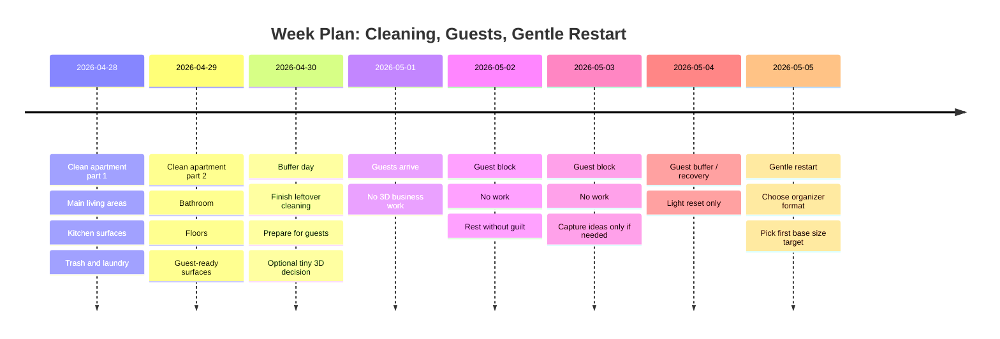
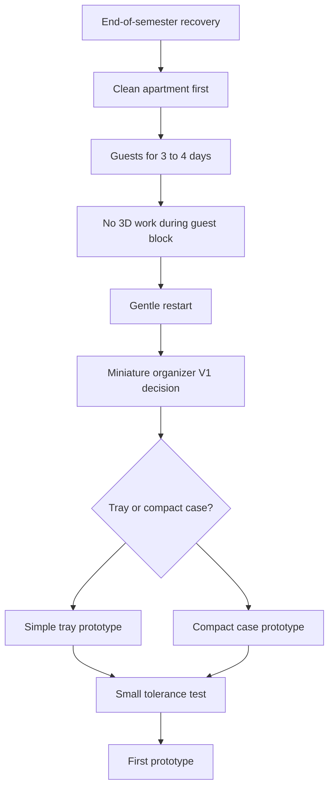
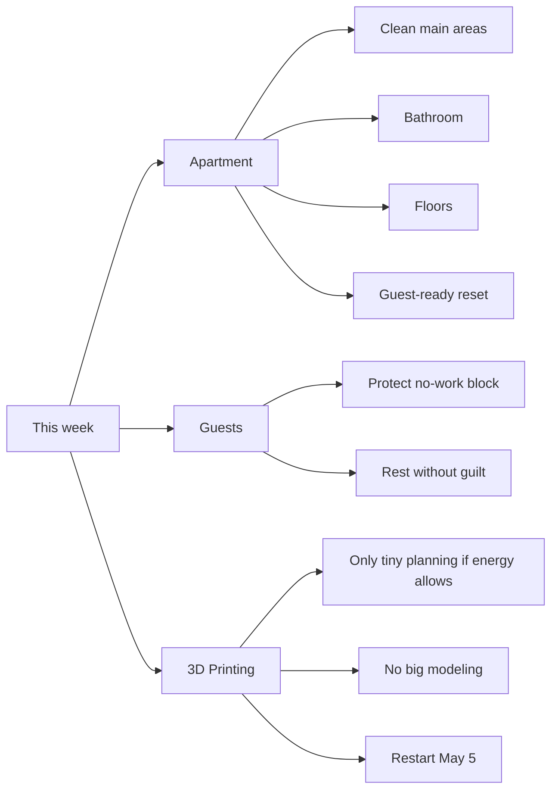
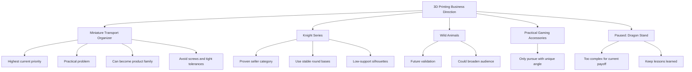
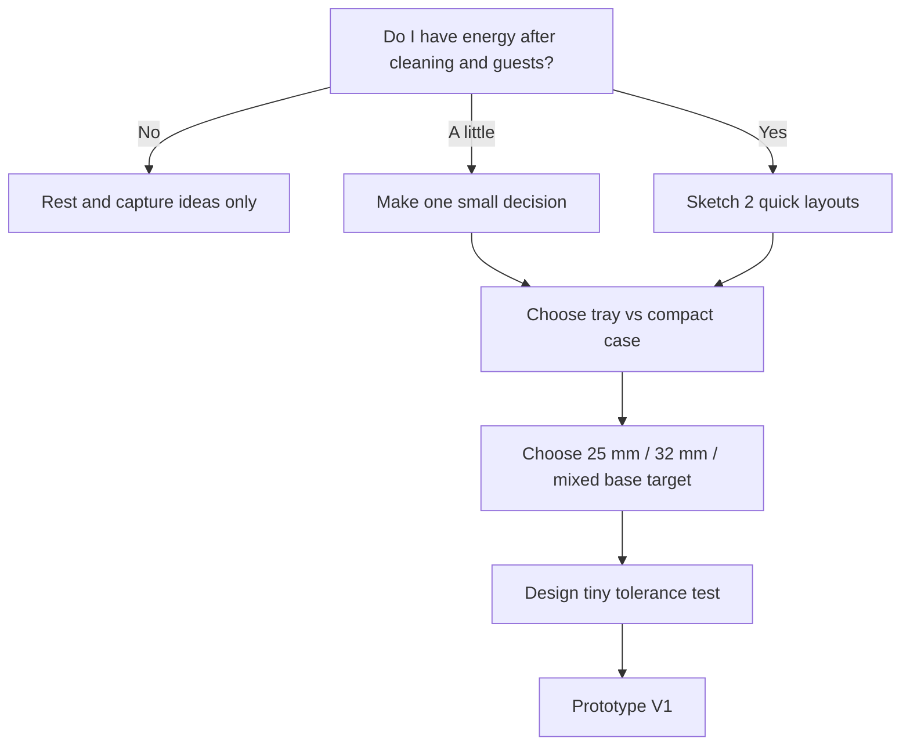

# Visual Dashboard

This file is the more visual version of the agenda.

It uses Mermaid diagrams, which GitHub can render directly inside Markdown files.

## Weekly planning image

A visual weekly planner image is stored here:

```text
assets/planning/week-planning-2026-04-28.svg
```

Preview:



## Current week timeline



## Main focus flow



## Weekly priority map



## Product direction map



## Simple decision tree for the next 3D project



## Current status board

| Area | Status | Next step |
|---|---|---|
| Apartment | Active priority | Clean in two parts before guests |
| Guests | Scheduled block | No 3D work Friday to Monday |
| Miniature organizer | Best next product | Decide tray vs compact case after guest block |
| Knight series | Keep warm | Brainstorm later, not urgent this week |
| Wild animals | Later | Validate after current project direction is clearer |
| Dragon stand | Paused | Do not return unless simplified heavily |

## How to use this dashboard

Use this file when you want a quick visual overview.

Use `planning/visual-agenda.md` when you want the detailed day-by-day checklist.

Recommended workflow:

1. Check the weekly planning image.
2. Check the timeline.
3. Check the main focus flow.
4. Look at the current status board.
5. Do only the next realistic step.
